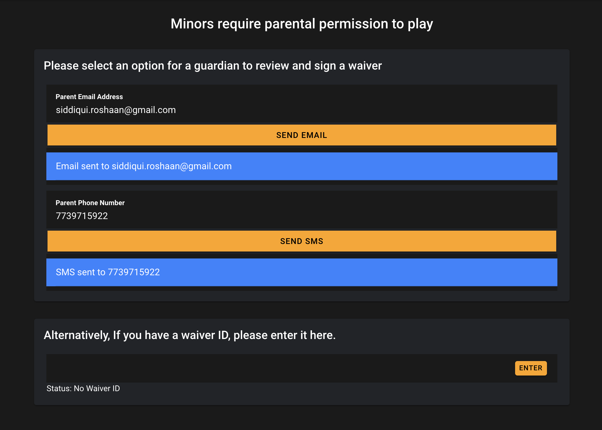

# Electronic Signature Tool

> **Note:** This tool does not have a live interactive demo as the functionality for sending emails and SMS as well as the database for authenticating users resides in MassVr's private servers. 
## What is it?
### This tool was created for MassVr so that minors who visit their locations without their parents can make their parents sign the liability waivers over text or email. 

# Things I learned
- I learned to use the Ionic Framework for creating web applications
- I learned how to manage dependencies across projects 
- I learned to utlize Twilio for sending SMS messages
- Learned how to use Firebase Cloud functions to deploy custom functions
- Learned database terminology and how to use postgresql database to store and authenticate minors upon having their parents sign the waiver electronically
- Gained basic familiarity with Scala's Slick Framwork 
- Learned to use CSS's Flexbox's and other techniques to create responsive web pages

# Features
- Email or SMS the parents the waiver via a website so they can sign it
- If the Minor has a waiver ID, they may alternetively enter that in and authenticate the waiver
- Live updates every 10 seconds to see if parents have signed the waiver

*What minors See when they visit a MassVr location*
 

